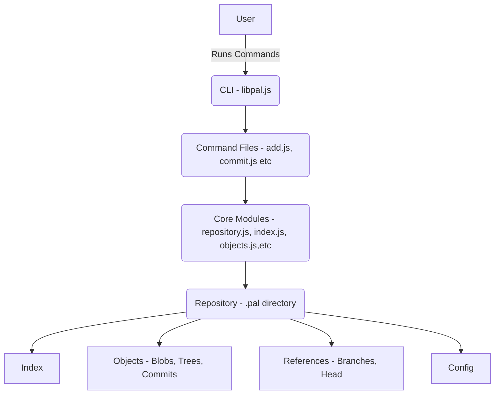

<a id="readme-top"></a>
<!-- TABLE OF CONTENTS -->
<details>
  <summary>Table of Contents</summary>
  <ol>
    <li><a href="#Project_Overview">Project Overview</a></li>
    <li><a href="#System_Architecture_Design">System Architecture Design</a></li>
    <li><a href="#Tour_of_The_Codebase (Directory_Tree)">Tour of The Codebase (Directory Tree)</a></li>
    <li><a href="#Installation_Guide">Installation Guide</a></li>
    <li><a href="#Usage_Manual">Usage Manual</a></li>
    <li><a href="#Limitations_and_Future_Improvementse">Limitations and Future Improvements</a></li>
    <li><a href="#Resources">Resources</a></li>
    <li><a href="#contact">Contact</a></li>
    <li><a href="#License">License</a></li> 
  </ol>
</details>

## Project Overview
This project is a custom implementation of a distributed version control system built in the style of `Git` but differentiated by using the `pal` keyword to avoid confusion with the standard Git software. While following a similar file structure and core principles, `pal` includes all essential version control functionalities. Users can initialize a directory, which creates a `.pal`  subdirectory directory to store repository metadata and internal objects. Core features include staging files, committing changes, viewing commit history, creating and switching between branches, performing diffs for conflict detection, merging branches, cloning repositories, and ignoring files using `.palignore`. The tool is packaged as an `npm` package, making it publicly available and easy to install and run locally as long as Node.js and npm are accessible. The system's modular design ensures maintainability, scalability, and ease of future enhancements. Comprehensive documentation is included, with a detailed example usage walkthrough provided in a linked PDF to help users understand the solution and its implementation.


## System Architecture Design
The project follows a moular and layered architecture to ensure scalabilty and maintainability. Each layer is responsible for a specific part of the system's functionality

### System Design Diagram



### Component Breakdown
1. **User Interaction(CLI)** - This is the entry point for the user, it is a simple terminal interface for users to interact with the system. It is where commands like `pal add`, `pal commit`, `pal log` etc are executed.
2. **CLI logic (`libpal.js`)** - Bridges user input with the command logic. Parses user commands and routes them to the corresponding command handler (e.g.,`pal add` → `add.js`).
3. **Command Files** - A collection of Javascript files that implement specific operations. For example, `add.js` - Stages files for the next commit.
4. **Core Modules** - Provide foundational functionality for repository management.
   Examples:
     * `repository.js`: Handles the `.pal` directory structure and metadata.
     * `index.js`: Manages the staging area(index).
     * `objects.js`: Manages version-controlled data objects like blobs (files), trees (directories), and commits.
     * `references.js`: Tracks branches and HEAD pointers.
5. **Repository (`.pal` Directory)**: The central storage for all repository-related data and metadata. Contains the version-controlled data, staging area, branch references, and repository specific configuration (Specifically, User Information details).

### The `.pal` Directory Structure
The `.pal` directory is a hidden folder in the root of the repository. It stores all the data and metadata required to manage version control. It mimics Git's `.git` directory structure. Below is an overview of its structure:
```bash
.pal/
├── 📁 branches/                (Future support) Will store remote branch references
├── 📁 objects/                 Stores all data objects (blobs, trees, commits)
├── 📁 refs/
│   ├── 📁 heads/               Stores references to local branches
│   └── 📁 tags/                (Future Support) Stores references to tags
├── 📄 index                    The staging area file
├── 📄 HEAD                     Points to the currently active branch
├── 📄 config                   Stores user and repository configuration
└── 📄 description              (Future support) A text description of the repository
```
### Components of .pal:
1. **Objects**: Contains all data stored in the repository. Files are stored using their SHA-1 hashes. The types of files are listed below,
   * Blobs: Represent individual file contents.
   * Trees: Represent directory structures.
   * Commits: Represent snapshots of the repository state.
2. **Refs**: Tracks the state of branches and tags.
    * heads/: Local branch pointers (e.g., refs/heads/main points to the latest commit on the main branch).
    * tags/: Points to specific commits with annotated or lightweight tags.
3. **Index**: The staging area file that tracks files added by the `pal add` command. prepares the list of files for the next commit.
4. **HEAD**: A symbolic reference pointing to the currently active branch.
5. **Config**: Contains repository-specific settings (user name and email).

### How the System Works
The system operates through a series of layered interactions, with data flowing from the user through the CLI and command files to the core modules, and finally into the repository.

**Example Flow: Commit Operation**

1. The user executes `pal commit -m "Initial commit"`.
2. `libpal.js` routes the command to `commit.js`.
3. `commit.js` interacts with:
  * `index.js` to collect staged files.
  * `objects.js` to create a commit object with the staged files.
4. The commit object is stored in `.pal/objects`, and the branch reference in `.pal/refs/heads` is updated to point to it.

### Benefits of This Architecture
* Modularity: Each component has a single responsibility, making the system easy to understand and maintain.
* Scalability: New commands or features can be added without disrupting the core functionality.
* Efficiency: The .pal directory is designed for quick access and efficient storage of repository data.

<p align="right">(<a href="#readme-top">back to top</a>)</p>

## Tour of The Codebase (Directory Tree)

```bash
CLI/
├── 📁 bin/                 Entry point for the CLI application
│   └── 📄 pal.js           The executable script for the CLI
├── 📁 CLI/                 Contains CLI logic and initialization
│   └── 📄 libpal.js        Main CLI file for all command definitions
├── 📁 src/                 Core application logic
│   ├── 📁 commands/        Contains commands for the CLI
│   │   ├── 📄 add.js           Handles adding files to the index
│   │   ├── 📄 catFile.js       Displays content of repository objects
│   │   ├── 📄 checkIgnore.js   Manages ignored files
│   │   ├── 📄 clone.js         Handles repository cloning
│   │   ├── 📄 commit_utils.js  Utilities for handling commits
│   │   ├── 📄 diff.js          Shows differences between branches
│   │   ├── 📄 hashObject.js    Hashes and writes objects to the repository
│   │   ├── 📄 logs.js          Displays commit history
│   │   ├── 📄 lsFiles.js       Lists staged files
│   │   ├── 📄 lsTree.js        (Future Support) Lists content of tree objects
│   │   ├── 📄 merge.js         Merges branches
│   │   ├── 📄 rm.js            Removes files from the index
│   │   ├── 📄 status.js        (Future Support) Shows repository status
│   │   └── 📄 tags.js          (Future Support) Manages tags
│   ├── 📁 core/             Core modules for internal operations
│   │   ├── 📄 branch.js        Handles branching logic
│   │   ├── 📄 config.js        Reads and parses configuration eg user details
│   │   ├── 📄 index.js         Manages the repository index
│   │   ├── 📄 objects.js       Handles Git objects (blobs, trees, commits)
│   │   ├── 📄 references.js    Manages references like HEAD and branches
│   │   ├── 📄 repository.js    Core repository functions
│   │   ├── 📄 trees.js         Handles Git tree objects
│   │   └── 📄 utils.js         General utility functions
├── 📄 .gitignore            Specifies files to be ignored by version control
├── 📄 .npmignore            Specifies files to be ignored by npm
├── 📄 package.json          Project metadata and dependencies
└── 📄 package-lock.json     Detailed dependency tree for reproducible builds
└── 📄 Example_Usage PDF     Detailed example usage walkthrough of the solution.
```

<p align="right">(<a href="#readme-top">back to top</a>)</p>


## Installation Guide
_For more detailed explanation and usage manual guide, please refer to the [Example Usage Walkthrough Documentation](CLI/pal_Example_Usage_Walkthrough - PDF.pdf)_


Follow these steps to set up and use the Pal CLI tool on your machine, preferably on a system running Windows.

### Prerequisites
Ensure you have the following installed and accessible on your machine:
* **Node.js** and **npm**
Confirm installation by running.
```sh
node -v
npm -v
   ```
  

### Install the CLI Tool
Pal CLI is an npm package. Install it globally using the following command:
```sh
npm install -g @kennynyamai/pal-sc-cli
   ```
Verify the installation by checking the tool's version:
```sh
pal --version
   ```
## Usage Manual
The Pal CLI tool provides various commands for managing a distributed version control system. Below is a step-by-step guide for using each command:

### 1.Initialize a Repository
 **Command:**
```sh
pal init
```

**Examples:**
* Initialize a repository in the current directory.
 ```sh
  pal init
  ```

* Initialize a repository in a new folder named `my-project`:
```sh
pal init my-project
```

### 2. Add Files to the Index
* **Command:**
  
```sh
pal add <file...>
```
* Stages one or more files for the next commit.
  
**Examples:**
* Stage a single file
```sh
pal add file1.txt
```
* Stage multiple files:
```sh
pal add file1.txt file2.txt
```
### 3. Remove files from the Index
**Command**
```sh
pal rm <file...>
```
* Removes one or more files from the staging area
### 4. Commit Changes
**Command**
```sh
pal commit -m <message>
```
* Creates a new commit with a descriptive message for the staged changes.
  
**Example**
  * Commit staged changes with a message.
```sh
pal commit -m "Initial commit"
```
### 5. Log Commit History
**Command**
```sh
pal log
```
* Shows the commit history, including commit messages, authors, and hashes.
### 6. List staged files.
**Command**
```sh
pal ls-files
```
* Lists all files that have been staged in the repository.
### 7. View Repository Objects
**Command**
```sh
pal cat-file <type> <object>
```
* Displays the content of repository objects such as blobs, commits, and trees.

**Example**
* View a blob Object
```sh
pal cat-file blob <sha>
```
### 8. Hash a file
**Command**
```sh
pal hash-object <file>
```
* Computes the hash of a file
### 9. Create and List Branches
**Command**
```sh
pal branch <name>
```
* Creates a new branch
```sh
pal branch
```
* Lists all branches, also shows the active branch
### 10. Switch Branches
**Command**
```sh
pal checkout <existing_branch>
```
### 11. Merge Branches.
**Command**
```sh
pal branch <specified_branch> <current_branch>
```
* Merges the specified branch into the current branch.
### 12. Show Differences between branches.
**Command**
```sh
pal diff <branch1> <branch2>
```
### 13. Clone a Repository
**Command**
```sh
pal clone <source> <destination>
```
**Example**
```sh
pal clone "/path/to/source/" "/path/to/destination/"
```
### Check Ignored files
**Command**
```sh
pal check-ignore <file..>
```
* Checks if one or more specified files are ignored based on the `.palignore` rules.
  
**Notes**

* Ensure a .palignore file exists at the root of the directory to define the ignore rules.
* Useful for debugging ignored files and verifying `.palignore` configurations.

<p align="right">(<a href="#readme-top">back to top</a>)</p>


  ## Limitations and Future Improvements
While Pal DSCS is functional and provides the core control features, there are areas where the tool can be improved. Below is a list of current limitations, what the tool can and cannot do, and possible future enhancements:
### 1. Merge Commit Visibility
* **Limitation**: The merge functionality creates a new merge commit during the process, but this commit does not appear in the commit history when using the `pal log` command.
* **What It Can Do**: Successfully creates merge commits and updates references.
* **What It Cannot Do**: Display the merge commit in the commit history.
* **Future Improvement**: Investigate and resolve the issue by debugging the commit history traversal logic to include merge commits in the  `pal log` output.
### 2. Ignoring Directories.
* **Limitation**: While the tool supports ignoring files using a `.palignore` file, it cannot currently ignore entire directories.
* **What It Can Do**: Ignore individual files based on patterns in the `.palignore` file.
* **What It Cannot Do**: Ignore directories recursively.
* **Future Improvement**: Extend the `.palignore` functionality to support directory-level ignore rules, ensuring recursive exclusion of directories.
### 3. Staging Directories
* **Limitation**: Files can be added to the staging area, but entire directories cannot be staged at once.
* **What It Can Do**: Stage individual files for the next commit.
* **What It Cannot Do**: Stage all files within a directory in a single operation.
* **Future Improvement**: Implement recursive staging for directories, allowing users to stage all files in a directory with one command.
### 4. Cross-Platform Compatibility
* **Limitation**: The CLI tool was developed and tested primarily on Windows, and it has not been optimized for cross-platform compatibility.
* **What It Can Do**: Perform core functionality reliably on Windows systems.
* **What It Cannot Do**: Guarantee consistent behavior on Linux or macOS environments.
* **Future Improvement**: Optimize the tool for cross-platform compatibility by addressing issues such as path normalization, permissions, line endings, and proper handling of non-ASCII/UTF-8 text. Use automated testing in multiple environments (e.g., GitHub Actions) to validate compatibility on Linux and macOS.
### 5. Conflict Resolution in Merging
* **Limitation**: The merging functionality can detect conflicting changes but lacks built-in conflict resolution features.
* **What It Can Do**: Detect conflicts by traversing the commit history and finding the most recent common commit between branches.
* **What It Cannot Do**: Allow users to resolve merge conflicts directly within the tool.
* **Future Improvement**: Implement a conflict resolution feature to enable users to manually or automatically resolve conflicts during a merge process.
### 6. Graphical User Interface (GUI)
* **Limitation**: The tool is currently CLI-based and lacks a graphical interface.
* **What It Can Do**: Provide a command-line interface for interacting with the repository.
* **What It Cannot Do**: Offer a visual desktop application for version control tasks.
* **Future Improvement**: Develop a GUI using frameworks like Electron.js and React to create a desktop application for the distributed source control system, making it more accessible to non-technical users.

<p align="right">(<a href="#readme-top">back to top</a>)</p>


## Resources

* [Building Git by James Coglan](https://www.scribd.com/document/505270284/Building-Git)
* [Write yourself a Git!](https://wyag.thb.lt/)

<p align="right">(<a href="#readme-top">back to top</a>)</p>


<!-- CONTACT -->
## Contact

Kennedy Mwendwa - [kennynyamai73@gmail](kennynyamai73@gmail.com) 

Project Link: [https://github.com/Kennynyamai/Pal_Distributed_Source_Control_System](https://github.com/Kennynyamai/Pal_Distributed_Source_Control_System.git)

<p align="right">(<a href="#readme-top">back to top</a>)</p>


## License

Distributed under the MIT License. See `LICENSE` for more information.

<p align="right">(<a href="#readme-top">back to top</a>)</p>


  
